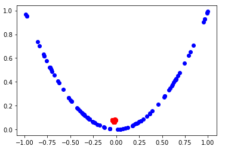
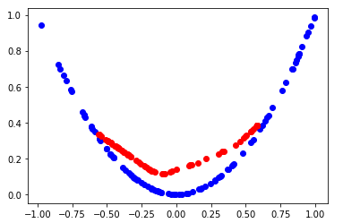
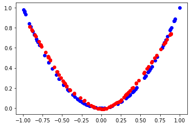
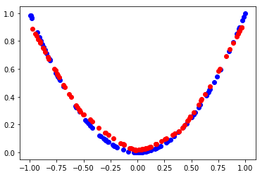
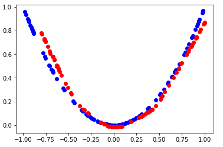
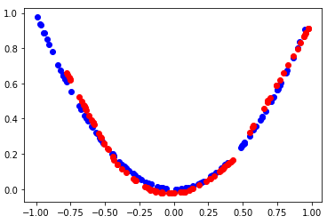

# GAN-tutorial

A Generative Adversarial Net or GAN, is a deep learning architecture for creating generator models. 
A generator model is capable of generating new artificial samples that are good enough to have come from an existing distribution of samples. 
GANs are comprised of both generator and discriminator models. The generator is responsible for generating new samples from the domain, and the discriminator is responsible for classifying whether samples are real or fake (generated). Importantly, the performance of the discriminator model is used to update both the model weights of the discriminator itself and the generator model. This means that the generator never actually sees examples from the domain and is adapted based on how well the discriminator performs. 
The objective of this notebook is to present the pratical intuition behind GANs and to showcase the unique idea they are based on. 

## Training Progress

 
 
 
 
 
 
